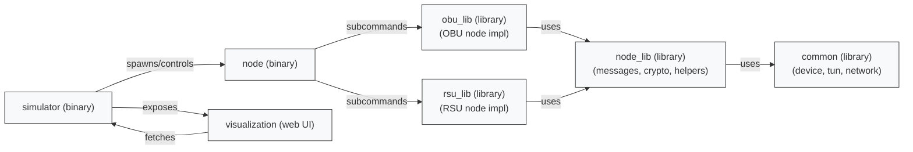

# Repository architecture (high level)

This document gives a concise overview of the main crates and how they interact.

Files / crates:
- `simulator/` - simulation runtime (creates nodes, orchestrates netns). Uses a `node_factory` to build OBU/RSU nodes via `obu_lib` and `rsu_lib`.
- `node/` - thin binary with CLI subcommands (`node rsu` / `node obu`) delegating to the respective libs.
- `obu_lib/` - OBU node implementation (control-plane, session, args, creation helpers).
- `rsu_lib/` - RSU node implementation (control-plane, args, creation helpers).
- `node_lib/` - shared building blocks used by both OBU/RSU (messages, crypto, metrics, test helpers, routing utils).
- `common/` - shared utilities (tun, device, network interface helpers).
- `visualization/` - web UI consuming simulation state (node_info endpoint).

Tips:
- Each crate contains its own `ARCHITECTURE.md` with focused details.
- Use these diagrams when debugging routing/control interactions or extending modules.

## N-best cached upstream candidates and failover

Recent updates add N-best candidate tracking for OBU upstream selection and a fast failover mechanism.

- Purpose: keep the top-N upstream next-hop candidates (ranked by observed latency / hop-count) so an OBU can quickly fail over to the next-best route when a primary next hop becomes unavailable or fails.
- Configuration: the number of cached candidates is configurable per-node via `cached_candidates` (integer). The CLI/config struct is `ObuParameters.cached_candidates` and defaults to `3` when not specified.
- Behavior summary:
  - Route selection (`get_route_to(Some(mac))`) remains a pure/read-only operation that computes the best route without mutating node cache state.
  - `select_and_cache_upstream(mac)` computes and stores the primary cached upstream plus a top-N candidate list. The candidate list is used for quick promotion on failures but does not silently override the primary cached upstream (hysteresis is preserved).
  - `failover_cached_upstream()` rotates the candidate list, promotes the next candidate to primary, and returns the newly chosen next-hop (or `None` if no candidates remain).
- Simulator and YAML: the simulator accepts a per-node `cached_candidates` key in node config (integer). Example YAML files in `examples/` include `cached_candidates: 3` as an explicit default.
- Recommended usage: call `failover_cached_upstream()` from higher-level code when a send or session failure to the current upstream is detected so the node can retry quickly using the next candidate.

This section documents the runtime behavior and the simulator/configuration key; for implementation details see `obu_lib/src/control/routing.rs` and `obu_lib/src/args.rs`.
