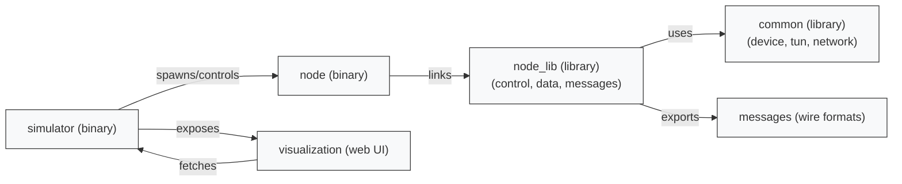

# Repository architecture (high level)

This document gives a concise overview of the main crates and how they interact.

Files / crates:
- `simulator/` - simulation runtime (creates nodes, orchestrates netns).
- `node/` - thin binary that runs nodes using `node_lib`.
- `node_lib/` - core node logic: control plane, data plane, message formats.
- `common/` - shared utilities (tun, device, network interface helpers).
- `visualization/` - web UI consuming simulation state (node_info endpoint).

Tips:
- Each crate contains its own `ARCHITECTURE.md` with focused details.
- Use these diagrams when debugging routing/control interactions or extending modules.
