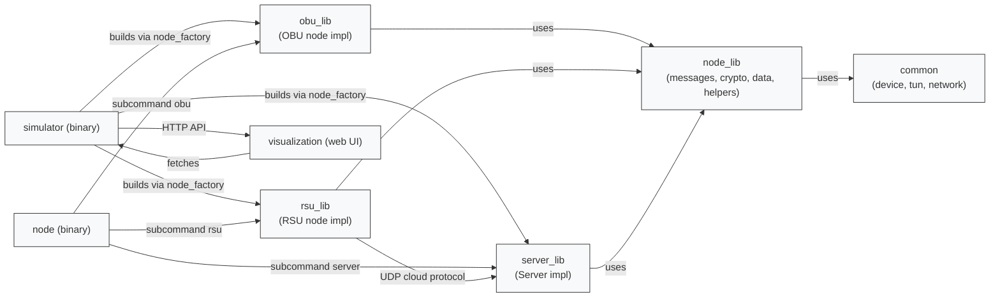

# Repository architecture (high level)

This document gives a concise overview of the main crates and how they interact.


```mermaid
flowchart LR
  Simulator["simulator (binary)"] -->|builds via node_factory| ObuLib
  Simulator -->|builds via node_factory| RsuLib
  Simulator -->|builds via node_factory| ServerLib
  NodeBinary["node (binary)"] -->|subcommand obu| ObuLib["obu_lib\n(OBU node impl)"]
  NodeBinary -->|subcommand rsu| RsuLib["rsu_lib\n(RSU node impl)"]
  NodeBinary -->|subcommand server| ServerLib["server_lib\n(Server impl)"]
  ObuLib -->|uses| NodeLib["node_lib\n(messages, crypto, data, helpers)"]
  RsuLib -->|uses| NodeLib
  ServerLib -->|uses| NodeLib
  NodeLib -->|uses| Common["common\n(device, tun, network)"]
  Simulator -->|HTTP API| Visualization["visualization (web UI)"]
  Visualization -->|fetches| Simulator
  RsuLib -->|UDP cloud protocol| ServerLib

  classDef crate fill:#f8f9fa,stroke:#333,stroke-width:1px;
  class Simulator,NodeBinary,NodeLib,Common,Visualization,ObuLib,RsuLib,ServerLib crate;
```

## Crates

- `simulator/` — simulation runtime: creates network namespaces, builds OBU/RSU/Server nodes via `node_factory`, applies per-link `tc netem` rules, exposes HTTP API and optional TUI.
- `node/` — thin binary with CLI subcommands: `node rsu`, `node obu`, `node server`.
- `obu_lib/` — OBU node: control plane, routing (heartbeat/reply, N-best upstream caching, failover), DH key store, TAP session handling.
- `rsu_lib/` — RSU node: heartbeat emission, routing reply tracking, client cache, opaque upstream forwarding to server over UDP.
- `server_lib/` — Server node: UDP cloud endpoint, OBU registry, per-OBU DH key management, decapsulation/re-injection via virtual TAP.
- `node_lib/` — shared building blocks: wire messages, crypto (X25519/HKDF/AEAD), data path helpers, `Node` trait, buffer pool, test helpers.
- `common/` — OS-level abstractions: `Tun` trait (with test shim), `Device`, `NetworkInterface`, `ChannelParameters`, optional `stats`.
- `visualization/` — Yew/WASM browser UI polling the simulator HTTP API.
- `scripts_tools/` — experiment data analysis CLI (`parse-band`, `build-summary`, `merge-latency`, `ns-addrs`, `generate-pairs`, `validate-configs`, `autofix-configs`).

## Three-tier network

```
┌─────────────────────────────────────────────────────────┐
│  VANET medium  (10.x.x.x)                               │
│  OBU ──wireless──► RSU                                  │
│  Messages: Heartbeat, HeartbeatReply, Data, KeyExchange │
└────────────────────────┬────────────────────────────────┘
                         │ RSU forwards opaque UDP
                         ▼
┌─────────────────────────────────────────────────────────┐
│  Cloud / infrastructure  (172.x.x.x)                    │
│  RSU ──UDP──► Server                                    │
│  Protocol: cloud_protocol (UpstreamForward, etc.)       │
└────────────────────────┬────────────────────────────────┘
                         │ Server decapsulates + decrypts
                         ▼
┌─────────────────────────────────────────────────────────┐
│  Virtual TAP  (overlay L2)                              │
│  OBU-side TAP ◄──── Server TAP                          │
│  Carries: decrypted IPv4/IPv6 payload                   │
└─────────────────────────────────────────────────────────┘
```

## Tips
- Each crate contains its own `ARCHITECTURE.md` with focused details.
- Use these diagrams when debugging routing/control interactions or extending modules.

## N-best cached upstream candidates and failover

Recent updates add N-best candidate tracking for OBU upstream selection and a fast failover mechanism.

- Purpose: keep the top-N upstream next-hop candidates (ranked by observed latency / hop-count) so an OBU can quickly fail over to the next-best route when a primary next hop becomes unavailable or fails.
- Configuration: the number of cached candidates is configurable per-node via `cached_candidates` (integer). The CLI/config struct is `ObuParameters.cached_candidates` and defaults to `3` when not specified.
- Behavior summary:
  - Route selection (`get_route_to(Some(mac))`) remains a pure/read-only operation that computes the best route without mutating node cache state.
  - `select_and_cache_upstream(mac)` computes and stores the primary cached upstream plus a top-N candidate list. The candidate list is used for quick promotion on failures but does not silently override the primary cached upstream (hysteresis is preserved).
  - `failover_cached_upstream()` rotates the candidate list, promotes the next candidate to primary, and returns the newly chosen next-hop (or `None` if no candidates remain).
- Simulator and YAML: the simulator accepts a per-node `cached_candidates` key in node config (integer). Example YAML files in `examples/` include `cached_candidates: 3` as an explicit default.
- Recommended usage: call `failover_cached_upstream()` from higher-level code when a send or session failure to the current upstream is detected so the node can retry quickly using the next candidate.

This section documents the runtime behavior and the simulator/configuration key; for implementation details see `obu_lib/src/control/routing.rs` and `obu_lib/src/args.rs`.
