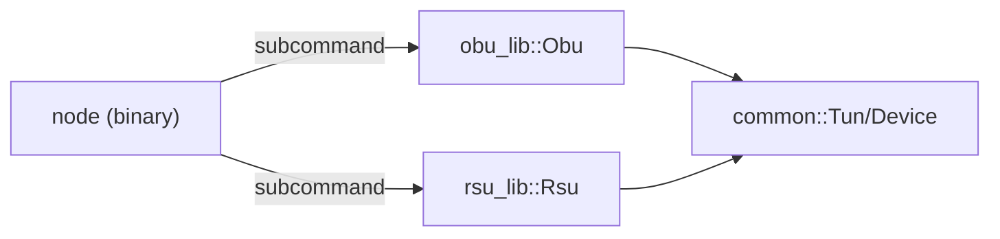

# node crate — architecture

Purpose: binary for running one node. Exposes subcommands and delegates to `obu_lib` or `rsu_lib`.

Notes:
- This crate provides a CLI with `node obu` and `node rsu` subcommands and initializes the respective node via `*_lib::create`.
- Useful for debugging per-node behavior in isolation.
