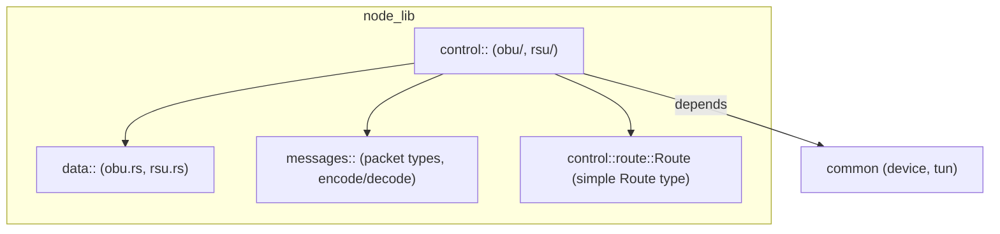

# node_lib crate — architecture (detailed)

Purpose: core node logic shared by node binaries and the simulator. It implements both the
control-plane (heartbeat-based topology discovery and routing) and the data-plane (upstream/
downstream packet handling) plus the wire message encoders/decoders.

High-level module map



Responsibilities
- `control/`
  - Submodules: `obu/`, `rsu/`, routing implementations and session handling.
  - Maintains routing state derived from Heartbeat messages and HeartbeatReply observations.
  - Makes forwarding decisions for Control and Data packets.
- `data/`
  - Upstream/Downstream parsing and helpers to build Data messages.
- `messages/`
  - Wire-level encoders/decoders: `Heartbeat`, `HeartbeatReply`, `Data` wrappers and `Message` container.

Routing data structures (conceptual)
- `routes: HashMap<MacAddress, IndexMap<u32, (Duration, MacAddress, u32, IndexMap<Duration, MacAddress>, HashMap<MacAddress, Vec<Target>>)>>`
  - Top-level key: RSU MAC (source of heartbeats we're tracking).
  - Within each `IndexMap` keyed by heartbeat sequence id: stores a tuple with
    - `duration` — when we saw the heartbeat (relative to boot)
    - `next_upstream` — the MAC which forwarded that heartbeat to us (our recorded next hop)
    - `hops` — advertised hops in that heartbeat
    - per-hop latency map and `downstream` observations (HashMap of observed targets -> Vec<Target>)

Key operations
- handle_heartbeat(pkt)
  - Insert heartbeat observations: both for message.source() (the original sender) and for pkt.from() (the immediate neighbor).
  - May generate a forward and a reply wire packet.
- handle_heartbeat_reply(pkt)
  - Locate the recorded heartbeat entry by `message.source()` and `message.id()`.
  - Record downstream observations (who claimed to be the original sender and which MAC carried the reply).
  - Decide whether to forward the HeartbeatReply toward `next_upstream` (the recorded next hop) or not.

Heartbeat/Reply sequence (mermaid sequence)


Decision logic notes
- Cached upstream
  - `get_route_to(None)` returns the cached upstream route (if present). Code stores `cached_upstream` on selection for faster upstream sends.
- Tie-breaking and selection
  - `get_route_to(Some(target))` performs a multi-step selection: prefer direct RSU entries (hops), favor cached upstream when it's still present, otherwise fold downstream observations, compute min/avg latency deterministic scores and pick the best.
- Loop/bounce prevention
  - We record downstream and per-hop latencies. When a HeartbeatReply arrives from the same MAC we would forward to (`pkt.from == next_upstream`) we do NOT forward it back to avoid an immediate bounce loop. Genuine loops (where the next hop equals the HeartbeatReply's reported sender, i.e. next_upstream == message.sender()) still bail.

Edge cases and pitfalls
- Asymmetric forwarding: replies may traverse different paths than heartbeats; record keeping must tolerate discrepant pkt.from and message.sender values.
- Stale sequences: `IndexMap` capacity is limited by `hello_history`; old entries are evicted. Be careful in tests to use matching ids.
- Concurrency: `Routing` is frequently wrapped by `RwLock` in runtime; heavy concurrency could produce stale reads — keep critical writes short and protected.

### Testing & shared test helpers

- Run unit and integration tests for the crate:

```sh
cargo test -p node_lib
```

- Shared helpers:
  - `node_lib::test_helpers::hub::Hub` — canonical in-process hub used by
    integration tests. It forwards frames between hub endpoints, can simulate
    per-link latency/loss and exposes upstream/downstream watch hooks so tests
    can assert on traffic patterns.
  - `common::tun::test_tun::TokioTun` + `common::Tun::new_shim` — a TUN shim
    for tests that lets you send/receive TAP frames without creating OS TUN
    devices.

When adding integration tests, prefer the shared `Hub` and TUN shim instead of
copying helper implementations into each test file; the repository already
contains `node_lib/tests/hub.rs` which re-exports the shared helper for
convenience.

Testing & debugging
- Unit tests: the crate already has focused tests for routing and message parsing. Add tests that:
  - Simulate heartbeat seen via a neighbor and a reply arriving via the same neighbor (assert no forward to avoid bounce).
  - Simulate a true loop (next_upstream == message.sender()) and assert the code bails.
  - Exercise `get_route_to` selection logic with multiple latency options.
- Runtime logging: important trace points are already present in `routing.rs` (route created/changed). For debugging loops add a log at the top of `handle_heartbeat_reply` showing `(pkt.from, message.sender, next_upstream)` and the decision (record-only / forward / bail).

Suggested next improvements
- Add unit tests for the failure/misforwarding scenario observed in live runs (already included as a regression test in the codebase after recent fixes).
- Add a small ASCII/mermaid flow showing `routes` structure state transitions (heartbeat insert, heartbeat-reply update).
- Instrument metrics: forward_count, drop_count, loop_detected_count to better analyze live behavior.

Maintenance notes
- Keep `messages` layout deterministic so unit tests can compose raw `Message` bytes.
- When changing routing heuristics, add tests that assert deterministic selection (min/avg scoring) to avoid flakiness.

If you want I can expand this file with concrete examples (byte-level message layout, sample `routes` map dump before/after) or add a troubleshooting checklist for runtime loops. Tell me which you'd prefer.

---

Additional important operational details

- Caching semantics (important)
  - `get_route_to(Some(mac))` is intended to be a pure read-only selection: it should not mutate global state. However, `get_route_to(Some(mac))` previously used `cached_upstream` heuristics in the same call path and could store into `cached_upstream`. This is surprising when callers hold read locks and can cause unexpected cross-thread cache mutations.
  - Recommended contract: treat `get_route_to(Some(_))` as pure and add an explicit `select_and_cache_upstream()` write-path that callers invoke when they intend to update the cached upstream. This avoids hidden writes under read locks and keeps the interface predictable.

Updated API contract (implemented)
- `get_route_to(Some(mac))` is now pure: it computes the best route to `mac` and does not mutate `Routing` internal state.
- `select_and_cache_upstream(mac: MacAddress) -> Option<Route>` is provided as the explicit write API: it selects the best route for `mac` and stores the chosen upstream into `cached_upstream`.
- `get_route_to(None)` continues to return the currently cached upstream route, if any.

Callers: prefer `get_route_to(Some(_))` when only a read is needed. Call `select_and_cache_upstream()` when you want to remember the selected upstream for future `get_route_to(None)` calls (for example, fast upstream sends from a TAP).

- Concurrency model
  - Routing state (`Routing`) is typically wrapped in an `Arc<RwLock<Routing>>` by callers (see `obu::Obu::routing`). Use `read()` for short read-only checks and `write()` for modifications.
  - Avoid calling functions that mutate internal cache fields while holding a `read()` lock. If a read-path must update a cache, document it clearly and prefer internal lock promotion or explicit write-call APIs.

- Feature flags & metrics
  - `node_lib` defines a `stats` feature in `Cargo.toml` (this enables `common/stats`). When `stats` is enabled the crate exposes lightweight atomic counters in `node_lib::metrics`.
  - Current counters: `inc_loop_detected()` and `loop_detected_count()`; consider adding `inc_skip_forward()` and `inc_forward()` for more observability.
  - To build with metrics enabled: `cargo build -p node_lib --features stats` (or enable the feature when building dependent crates).

Runtime example — enable stats and read counters

1) Build / test with the `stats` feature enabled

  # Run the unit tests with stats enabled (fast verification)
  cargo test -p node_lib --lib --features stats

  # Build the whole workspace with stats enabled
  cargo build --features stats

2) Run a node or simulator with the feature enabled

  # If you normally run the simulator or node with `cargo run`, enable stats on the workspace
  cargo run -p simulator --features stats --release

  # Alternatively build the specific binary with stats and run it directly
  cargo build -p simulator --features stats --release
  ./target/release/simulator --your-args

3) Read metrics from code (small example)

  // Any Rust binary that depends on `node_lib` (or tests) can read the counters:
  fn print_node_lib_metrics() {
      println!("loop_detected={}", node_lib::metrics::loop_detected_count());
      println!("cache_select={}", node_lib::metrics::cache_select_count());
      println!("cache_clear={}", node_lib::metrics::cache_clear_count());
  }

  Place the above in a diagnostic command or a small helper binary that links `node_lib` (ensure `--features stats` when building).

4) Quick debugging workflow

  - Run with tracing enabled at `trace` level to see cache clears and heartbeat-reply decisions:

      RUST_LOG=trace cargo run -p simulator --features stats --release

  - Use the `print_node_lib_metrics()` helper from an admin command or expose the counters on your `/node_info` endpoint for visualization.

Notes
  - The counters are atomic and cheap; they are no-ops when the `stats` feature is disabled.
  - Exposing the counters via the simulator's status API or writing them to logs periodically is the easiest way to surface them to the visualization layer.

- Unsafe parsing & robustness
  - `messages/control/heartbeat.rs` uses `unsafe get_unchecked` and unchecked slice conversions in several accessors. While tests ensure current message sizes, production inputs can be malformed and cause panics.
  - Recommendation: replace `unsafe` slices with safe `get()` checks in `TryFrom<&[u8]>` and accessor methods, returning `Result` or panicking with clearer errors only when assumptions are violated in code paths that construct messages.

- Troubleshooting / sample logs
  - Useful trace lines to enable while diagnosing routing loops:
    - `trace!(pkt_from = %pkt_from, message_sender = %sender, next_upstream = %next_upstream, action = %action, "heartbeat_reply decision")` — added to `handle_heartbeat_reply`.
    - `debug!(from = %mac, to = %message.source(), through = %new_route, "route created on heartbeat")` — already present.
  - Example interpretation:
    - If you see many alternating `route created on heartbeat` lines for the same nodes, check that `pkt.from` is not equal to your `next_upstream` repeatedly; if so, enable the trace decision line to confirm `action` is `skip_forward` and observe if different nodes keep forwarding the same reply back and forth.

---

Where to expand next
- Add an explicit section describing the `routes` map before/after a heartbeat+reply pair (sample dump).
- Add a short guide showing how to enable `stats` in the simulator and wire counters to `/node_info` for visualization.
- Replace unsafe parsing with safe code and add fuzz-style tests for malformed packets.

## N-best cached upstream candidates (OBU routing)

The OBU routing logic now stores a small ordered list of N-best upstream candidates for each selected upstream target. This is intended to reduce failover latency when a primary next-hop becomes unreachable.

Key points:

- Config: `NodeParameters.cached_candidates` (type: integer) controls the number of candidates cached; default is `3`.
- Selection vs. Caching:
  - `get_route_to(Some(target_mac))` computes the best route but must not mutate cached state.
  - `select_and_cache_upstream(target_mac)` is the write-api: it selects the primary route and also computes a top-N candidate list (ranked by latency and hop-count) and stores it in `Routing` state.
- Failover API:
  - `Routing::get_cached_candidates()` exposes the current candidate list for diagnostics.
  - `Routing::failover_cached_upstream()` rotates/promotes the next candidate and returns the newly promoted next hop (or `None`). This method is intended to be called by higher-level OBU/session code when an upstream send or session error occurs.
- Hysteresis: the implementation intentionally avoids silently replacing the primary cached upstream when recomputing candidates so that existing hysteresis behavior remains intact (to avoid flapping between equivalent routes).

See `node_lib/src/control/obu/routing.rs` for the implementation and tests that demonstrate selection, candidate population, and the failover rotation behavior.
