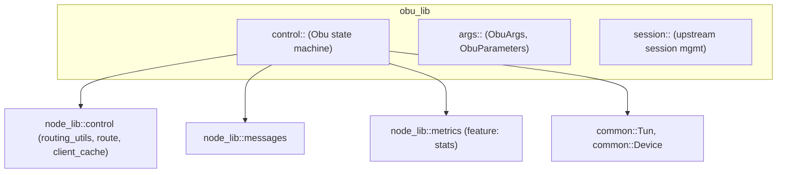

# obu_lib crate — architecture

Purpose: concrete OBU node implementation. Owns the OBU control plane, session handling, and CLI args.

Key responsibilities
- Parse CLI/config into `ObuArgs` and `ObuParameters`.
- Create and own `common::Tun` and `common::Device` instances.
- Run the OBU control loop: process Heartbeat/Reply, maintain cached upstream, and forward data.
- Implement N-best upstream candidate caching and fast failover.

Configuration
- `ObuParameters`
  - `hello_history: u32`
  - `cached_candidates: u32` (default 3)
  - `enable_encryption: bool` (optional)

APIs
- `create(args: ObuArgs) -> Arc<dyn Node>`: construct with a real TUN.
- `create_with_vdev(args: ObuArgs, tun: Arc<Tun>, device: Arc<Device>) -> Arc<dyn Node>`: inject shims (used by simulator/tests).

See also
- `obu_lib/src/control/routing.rs` for route selection and candidate management.
- `simulator/src/node_factory.rs` for how the simulator builds OBUs from YAML.
