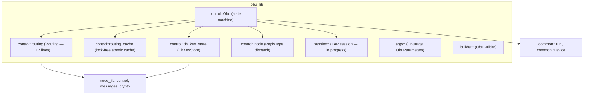

# obu_lib crate — architecture

Purpose: concrete OBU node implementation. Owns the control plane, DH key store, routing table, and TAP session management.


```mermaid
flowchart TB
  subgraph obu_lib
    OB["control::Obu (state machine)"]
    RO["control::routing (Routing — 1117 lines)"]
    RC["control::routing_cache (lock-free atomic cache)"]
    DH["control::dh_key_store (DhKeyStore)"]
    NO["control::node (ReplyType dispatch)"]
    SE["session:: (TAP session — in progress)"]
    AR["args:: (ObuArgs, ObuParameters)"]
    BU["builder:: (ObuBuilder)"]
  end

  OB --> RO
  OB --> RC
  OB --> DH
  OB --> NO
  OB --> SE
  RO --> NL["node_lib::control, messages, crypto"]
  DH --> NL
  OB --> CMN["common::Tun, common::Device"]
```

## Obu struct

```rust
pub struct Obu {
    args: ObuArgs,
    routing: Shared<Routing>,     // Heartbeat table + upstream selection
    tun: SharedTun,               // Virtual TAP (decapsulated traffic overlay)
    device: SharedDevice,         // VANET interface (wireless medium)
    session: Arc<Session>,        // TAP frame dispatcher
    node_name: String,
    dh_key_store: SharedKeyStore, // Per-server DH-derived keys
    crypto_config: CryptoConfig,
}
```

## ObuParameters

| Field | Default | Purpose |
|---|---|---|
| `hello_history` | 10 | Heartbeat history window size |
| `cached_candidates` | 3 | N-best upstream candidates for failover |
| `enable_encryption` | false | Enable DH key exchange + AEAD payload encryption |
| `dh_rekey_interval_ms` | 43 200 000 (12 h) | Re-key interval |
| `dh_key_lifetime_ms` | 86 400 000 (24 h) | Key expiry TTL |
| `dh_reply_timeout_ms` | 5000 | Timeout before retrying `KeyExchangeInit` |
| `cipher` | aes-256-gcm | Symmetric cipher |
| `kdf` | hkdf-sha256 | Key derivation function |
| `dh_group` | x25519 | DH group |

## Routing (`control/routing.rs`)

~1117 lines organised in four sections:

1. **Construction & cache** — `new`, `get_cached_upstream`, `failover_cached_upstream`, `select_and_cache_upstream`
2. **Heartbeat handling** — `handle_heartbeat`: records entry in `IndexMap` bounded by `hello_history`; broadcasts onward; emits `HeartbeatReply`
3. **HeartbeatReply handling** — `handle_heartbeat_reply`: records downstream observations; loop/bounce prevention
4. **Route selection** — `get_route_to(Option<MacAddress>)`: pure read; composite latency/hop-count score with hysteresis (~10%)

Routing table structure:
```
routes: HashMap<
    MacAddress,                 // RSU MAC (heartbeat origin)
    IndexMap<u32, (             // seq_id → entry (evicted when > hello_history)
        Duration,               // arrival timestamp
        MacAddress,             // pkt.from (next upstream hop)
        u32,                    // hop count
        IndexMap<Duration, MacAddress>,    // per-hop latency observations
        HashMap<MacAddress, Vec<Target>>   // downstream observations
    )>
>
```

Test sub-modules (inline under `control/routing/`):
- `failover_tests`, `heartbeat_tests`, `cache_tests`, `selection_tests`, `regression_tests`, `loop_repro`

## DH Key Store (`control/dh_key_store.rs`)

Per-peer state machine: `None → Pending → Established`.
- `initiate_exchange(peer)` → returns `(key_id, pub_key_bytes)`
- `handle_incoming_init(peer, key_id, peer_pub)` → returns our `pub_key_bytes`
- `complete_exchange(peer, key_id, peer_pub)` → `Option<(key_bytes, duration)>`
- Retry/timeout: `is_pending_timed_out`, `reinitiate_exchange`, `increment_retries`
- Expiry: `is_key_expired(peer, lifetime_ms)`

## APIs

- `create(args) -> Arc<dyn Node>` — construct with real TUN/device (disabled under `test_helpers`)
- `create_with_vdev(args, tun, device, name)` — inject shims (simulator + tests)

## Network interfaces (per OBU)

| Interface | Network | Purpose |
|---|---|---|
| `vanet` TAP | 10.x.x.x | VANET wireless medium (Heartbeat, Data, KeyExchange) |
| `virtual` TAP | overlay L2 | Decapsulated traffic to/from server |

## See also
- `simulator/src/node_factory.rs` — how the simulator builds OBUs from YAML
- `node_lib/ARCHITECTURE.md` — shared crypto, messages, test helpers
