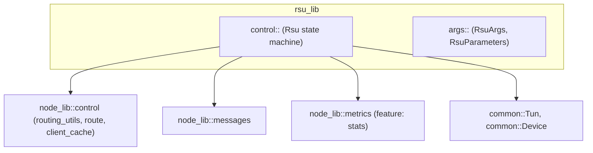

# rsu_lib crate — architecture

Purpose: concrete RSU node implementation. Owns the RSU control plane and CLI args.

Key responsibilities
- Parse CLI/config into `RsuArgs` and `RsuParameters`.
- Create and own `common::Tun` and `common::Device` instances.
- Emit periodic Heartbeat control messages and handle replies.
- Maintain routing advertisements for downstream nodes.

Configuration
- `RsuParameters`
  - `hello_history: u32`
  - `hello_periodicity: u32` (ms)
  - `cached_candidates: u32` (optional, for symmetry with OBU)
  - `enable_encryption: bool` (optional)

APIs
- `create(args: RsuArgs) -> Arc<dyn Node>`: construct with a real TUN.
- `create_with_vdev(args: RsuArgs, tun: Arc<Tun>, device: Arc<Device>) -> Arc<dyn Node>`: inject shims (used by simulator/tests).

See also
- `simulator/src/node_factory.rs` for how the simulator builds RSUs from YAML.
