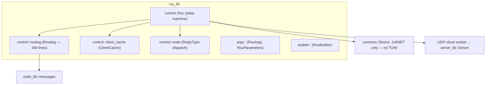

# rsu_lib crate — architecture

Purpose: concrete RSU node implementation. Owns the RSU control plane, heartbeat emission, client tracking, and opaque upstream forwarding to the server.


```mermaid
flowchart TB
  subgraph rsu_lib
    RS["control::Rsu (state machine)"]
    RO["control::routing (Routing — 349 lines)"]
    CC["control::client_cache (ClientCache)"]
    NO["control::node (ReplyType dispatch)"]
    AR["args:: (RsuArgs, RsuParameters)"]
    BU["builder:: (RsuBuilder)"]
  end

  RS --> RO
  RS --> CC
  RS --> NO
  RO --> NL["node_lib::messages"]
  RS --> CMN["common::Device  (VANET only — no TUN)"]
  RS --> UDP["UDP cloud socket → server_lib::Server"]
```

## Rsu struct

```rust
pub struct Rsu {
    args: RsuArgs,
    routing: Shared<Routing>,       // Heartbeat history + downstream table
    device: SharedDevice,           // VANET interface (no TUN)
    cache: Arc<ClientCache>,        // OBU VANET MAC → virtual MAC mappings
    cloud_socket: Arc<UdpSocket>,   // UDP socket to Server (cloud 172.x.x.x)
    node_name: String,
}
```

**Important**: RSUs have **no TAP/TUN device**. They are pure L2 VANET nodes that forward data opaquely to the server over UDP.

## RsuParameters

| Field | Default | Purpose |
|---|---|---|
| `hello_history` | 10 | Heartbeat history window |
| `hello_periodicity` | — | Interval between Heartbeat broadcasts (ms) |
| `cached_candidates` | — | Unused by RSU; kept for config symmetry |
| `server_ip` | None | Server cloud IP (`None` = no forwarding) |
| `server_port` | 8080 | Server UDP port |

## Routing (`control/routing.rs`)

349 lines. Simpler than OBU routing:
- `send_heartbeat(address)` — constructs and broadcasts `Heartbeat` to all neighbours (dst `ff:ff:ff:ff:ff:ff`)
- `handle_heartbeat_reply(msg, rsu_mac)` — records downstream OBU observations; builds topology for routing
- `get_route_to(Option<MacAddress>)` — pure read; returns best next-hop for a given MAC
- `iter_next_hops()` — iterates over all known next hops

**No decryption**: RSU forwards `Data::Upstream` payloads to the server as raw bytes inside `UpstreamForward` UDP messages. It never holds or uses session keys.

## ClientCache (`control/client_cache.rs`)

Thread-safe MAC address mapping used to route downstream traffic:
- `store_mac(client_mac, node_mac)` — record OBU association
- `get(client_mac)` — look up node MAC for a client
- `get_all_clients()` — enumerate all tracked clients

## Cloud protocol

When the RSU receives upstream data from an OBU:

```
OBU → Heartbeat/Data (VANET) → RSU
RSU wraps payload in UpstreamForward binary protocol
RSU → UDP → Server (cloud 172.x.x.x)
```

When the RSU receives downstream data from the server:
```
Server → DownstreamForward (UDP) → RSU
RSU unwraps and constructs Data::Downstream (VANET)
RSU → VANET → OBU
```

Key exchange messages are forwarded in the same opaque manner via `KeyExchangeForward` and `KeyExchangeResponse`.

## APIs

- `create(args) -> Arc<dyn Node>` — construct with real device (disabled under `test_helpers`)
- `create_with_vdev(args, device, name)` — inject shim device (simulator + tests)
  Note: no `tun` parameter — RSU does not use a TUN device.

## Network interfaces (per RSU)

| Interface | Network | Purpose |
|---|---|---|
| `vanet` TAP | 10.x.x.x | VANET medium (Heartbeat, Data, KeyExchange) |
| `cloud` TAP | 172.x.x.x | Infrastructure connection to Server (UDP socket bound here) |

## See also
- `server_lib/` — the server that receives RSU upstream forwards
- `simulator/src/node_factory.rs` — how the simulator builds RSUs from YAML
- `node_lib/ARCHITECTURE.md` — shared messages and test helpers
