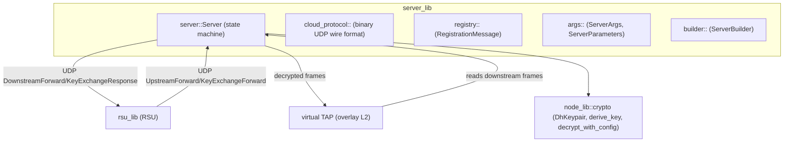

# server_lib crate — architecture

Purpose: the server-side endpoint in the three-tier vehicular network. Receives upstream data from RSUs over UDP, maintains per-OBU DH-derived keys, decrypts payloads, and injects them into a virtual TAP device. Sends downstream traffic back to OBUs through their associated RSU.



## Server struct

```rust
pub struct Server {
    ip: Ipv4Addr,                                  // cloud interface IP
    port: u16,                                     // UDP listen port
    socket: Arc<Mutex<Option<Arc<UdpSocket>>>>,
    registry: Arc<RwLock<HashMap<MacAddress, Vec<MacAddress>>>>,
    // RSU VANET MAC → [associated OBU VANET MACs]
    obu_routes: Arc<RwLock<HashMap<MacAddress, ObuRoute>>>,
    // virtual TAP MAC → (OBU VANET MAC, RSU UDP addr)
    tun: Option<SharedTun>,                        // virtual TAP device
    enable_encryption: bool,
    key_ttl_ms: u64,
    dh_keys: Arc<RwLock<DhKeyStore>>,             // per-OBU symmetric keys
    crypto_config: CryptoConfig,
}

struct ObuRoute {
    vanet_mac: MacAddress,   // OBU's VANET MAC (for DownstreamForward routing)
    rsu_addr: SocketAddr,    // RSU UDP address to send downstream replies through
}
```

## Cloud protocol (`cloud_protocol.rs`)

Binary UDP protocol with magic prefix `[0xAB, 0xCD]` and a 1-byte type discriminant.

| Direction | Type byte | Message | Description |
|---|---|---|---|
| RSU → Server | `0x02` | `UpstreamForward` | OBU payload (may be encrypted) + RSU MAC + OBU source MAC |
| Server → RSU | `0x03` | `DownstreamForward` | Server payload + OBU dest MAC + origin MAC |
| RSU → Server | `0x04` | `KeyExchangeForward` | OBU's `KeyExchangeInit` forwarded by RSU + RSU MAC |
| Server → RSU | `0x05` | `KeyExchangeResponse` | Server's `KeyExchangeReply` + OBU dest MAC |

`CloudMessage` is the top-level enum wrapping all four variants, parsed by `try_from_bytes`.

### Wire layouts

```
UpstreamForward:    [0xAB 0xCD] [0x02] [RSU_MAC 6B] [OBU_SRC_MAC 6B] [PAYLOAD ...]
DownstreamForward:  [0xAB 0xCD] [0x03] [OBU_DST_MAC 6B] [ORIGIN_MAC 6B] [PAYLOAD ...]
KeyExchangeForward: [0xAB 0xCD] [0x04] [RSU_MAC 6B] [CONTROL_PAYLOAD ...]
KeyExchangeResponse:[0xAB 0xCD] [0x05] [OBU_DST_MAC 6B] [RESPONSE_PAYLOAD ...]
```

## RSU registration (`registry.rs`)

RSUs periodically send a `RegistrationMessage` to the server:
```
[0xAB 0xCD] [0x01] [RSU_MAC 6B] [OBU_COUNT 2B big-endian] [OBU_MAC_0 6B] ...
```
The server stores `RSU_MAC → [OBU_MACs]` in `registry`, used for downstream routing decisions.

## ServerParameters

| Field | Default | Purpose |
|---|---|---|
| `port` | 8080 | UDP listen port |
| `enable_encryption` | false | Enable DH key exchange + AEAD decryption |
| `key_ttl_ms` | 86 400 000 (24 h) | Per-OBU key expiry |
| `cipher` | aes-256-gcm | Symmetric cipher (must match OBU config) |
| `kdf` | hkdf-sha256 | KDF (must match OBU config) |
| `dh_group` | x25519 | DH group |

## Data flow (encryption enabled)

```
1. OBU encrypts frame with AEAD key derived from DH shared secret
2. OBU → RSU: Data::Upstream (VANET, encrypted payload)
3. RSU wraps in UpstreamForward UDP → Server
4. Server decrypts with stored ObuKey
5. Server writes plaintext to virtual TAP

6. Application writes response to virtual TAP
7. Server reads frame from TAP, looks up OBU route by dest MAC
8. Server encrypts, wraps in DownstreamForward UDP → RSU
9. RSU constructs Data::Downstream, sends on VANET to OBU
10. OBU decrypts from TAP
```

## Network interfaces (per Server)

| Interface | Network | Purpose |
|---|---|---|
| `virtual` TAP | overlay L2 | Decapsulated traffic to/from OBUs |
| `cloud` TAP | 172.x.x.x | Infrastructure: UDP socket for RSU communication |

## APIs

- `create(args) -> Arc<Server>` — create and start server
- `Server::new(ip, port, name).with_tun(tun).with_encryption(true)...` — builder-style construction
- `Server::start()` — binds UDP socket and spawns background Tokio tasks

## See also
- `rsu_lib/ARCHITECTURE.md` — the RSU forwarding side
- `node_lib/ARCHITECTURE.md` — shared crypto (`DhKeypair`, `derive_key`, `decrypt_with_config`)

## Components

### Server (`src/server.rs`)

The core `Server` struct that handles UDP packet reception:

```rust
pub struct Server {
    ip: Ipv4Addr,
    port: u16,
    socket: Arc<Mutex<Option<Arc<UdpSocket>>>>,
}
```

**Key methods:**
- `new(ip, port)` - Creates a new Server instance
- `start()` - Binds to the UDP socket and spawns a background task to receive packets
- `ip()` - Returns the configured IP address
- `port()` - Returns the configured port

### Args (`src/args.rs`)

Command-line argument parsing using `clap`:

```rust
pub struct ServerArgs {
    pub ip: Ipv4Addr,
    pub server_params: ServerParameters,
}

pub struct ServerParameters {
    pub port: u16,
}
```

### Builder (`src/builder.rs`)

Fluent builder pattern for constructing Server instances:

```rust
ServerBuilder::new(ip)
    .with_port(8080)
    .build()
```

### Library Interface (`src/lib.rs`)

Public API for creating and managing Server instances:

```rust
pub async fn create(args: ServerArgs) -> Result<Arc<Server>>
```

## Usage Patterns

### As a Library

```rust
use server_lib::{ServerArgs, ServerParameters, create};
use std::net::Ipv4Addr;

let args = ServerArgs {
    ip: Ipv4Addr::new(192, 168, 1, 1),
    server_params: ServerParameters { port: 8080 },
};

let server = create(args).await?;
// Server is now listening and receiving packets
```

### In the Simulator

The simulator integrates Server nodes by:

1. Parsing Server node configurations from YAML
2. Creating Server instances using `ServerBuilder`
3. Starting the server after namespace creation
4. Server runs independently, receiving UDP traffic via normal networking

### As a Standalone Binary

The `node` binary supports running as a Server:

```bash
node server --ip 192.168.1.100 --port 8080
```

## Design Principles

### Simplicity

Server nodes are intentionally simple - they only receive UDP packets and log them. This makes them easy to understand, test, and extend.

### Independence

Unlike OBU/RSU nodes, Server nodes:
- Don't implement the `Node` trait
- Don't participate in routing protocols
- Don't require Device/Tun abstractions
- Use standard networking primitives

### Composability

The library is designed to be used in multiple contexts:
- Simulator integration
- Standalone binary
- Testing scenarios
- Custom applications

## Testing

Unit tests cover:
- Server creation and configuration
- UDP socket binding and listening
- Packet reception
- Builder pattern functionality

Run tests with:
```bash
cargo test -p server_lib
```

## Future Enhancements

Potential improvements:
- Packet statistics and metrics
- Response capability (bidirectional communication)
- Multiple listening addresses/ports
- TCP support
- Custom packet handlers/callbacks
- Integration with monitoring systems
