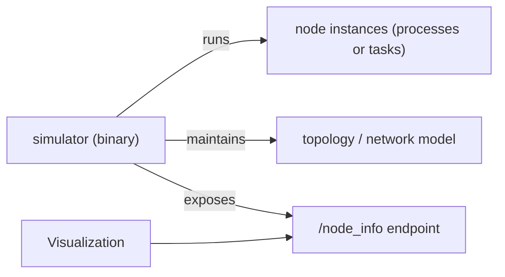

# simulator crate — architecture

Purpose: orchestrates a multi-node simulation (network namespaces, scheduled events, global state).

Notes:
- The simulator builds nodes via `node_factory` using `obu_lib` and `rsu_lib` (or by launching `node` binaries), configures network namespaces, and collects per-node state (used by visualization).
- `sim_args.rs` contains CLI/experiment wiring; `node_factory.rs` encapsulates creation of concrete OBU/RSU instances from config.
