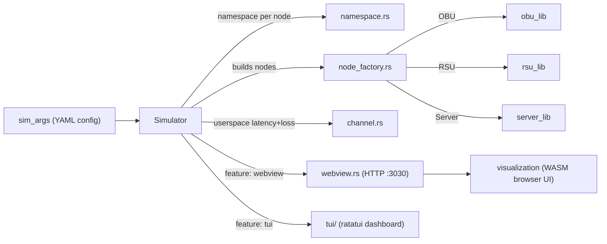

# simulator crate — architecture

Purpose: orchestrates a multi-node simulation using Linux network namespaces. Builds OBU, RSU, and Server nodes, applies per-link latency/loss rules entirely in userspace, and exposes an HTTP API and optional TUI.


```mermaid
flowchart LR
  SimArgs["sim_args (YAML config)"] --> Simulator
  Simulator -->|namespace per node| NS["namespace.rs"]
  Simulator -->|builds nodes| NF["node_factory.rs"]
  NF -->|OBU| ObuLib["obu_lib"]
  NF -->|RSU| RsuLib["rsu_lib"]
  NF -->|Server| ServerLib["server_lib"]
  Simulator -->|userspace latency+loss| CH["channel.rs"]
  Simulator -->|feature: webview| WV["webview.rs (HTTP :3030)"]
  Simulator -->|feature: tui| TUI["tui/ (ratatui dashboard)"]
  WV --> Visualization["visualization (WASM browser UI)"]
```

## Modules

| Module | Purpose |
|---|---|
| `sim_args` | CLI args: `--config-file`, `--pretty`, `--tui` |
| `simulator` | Orchestrator: namespace lifecycle, channel setup, packet forwarding loop |
| `node_factory` | Creates OBU/RSU/Server nodes from YAML `Config` within namespace context |
| `node_interfaces` | Organises per-node TAP interfaces into `NodeInterfaces` |
| `interface_builder` | Fluent builder for creating TAP devices with IP/MTU/netmask |
| `namespace` | `NamespaceManager` + `NamespaceWrapper`: create/enter/destroy network namespaces |
| `channel` | `Channel`: per-link latency/loss/jitter simulation in userspace via Tokio sleep + probabilistic drop |
| `topology` | Reads topology YAML; maps `node → {neighbour: ChannelParameters}` |
| `metrics` | `SimulatorMetrics`: per-node and aggregate counters |
| `webview` | `warp`-based HTTP server on port 3030 (feature: `webview`) |
| `tui` | `ratatui` terminal UI with tabs: Metrics, Logs, Nodes, Topology, Channels, Upstreams, Registry |

## node_factory — node creation

`create_node_from_settings(node_type, settings, node_name)` creates all required interfaces and the node instance inside the namespace context:

**OBU**
```
vanet TAP  (10.x.x.x)  → Arc<Device>   (VANET medium)
virtual TAP (overlay)   → Arc<Tun>     (decapsulated traffic)
→ obu_lib::create_with_vdev(args, tun, device, name)
```

**RSU**
```
vanet TAP  (10.x.x.x)  → Arc<Device>   (VANET medium)
cloud TAP  (172.x.x.x) → UdpSocket     (infrastructure to server)
→ rsu_lib::create_with_vdev(args, device, name)   // no TUN
```

**Server**
```
virtual TAP (overlay)   → Arc<Tun>     (decapsulated traffic to/from OBUs)
cloud TAP   (172.x.x.x) → UdpSocket   (receives RSU forwards)
→ server_lib::Server::new(...).with_tun(tun)...
→ server.start() called immediately (block_in_place)
```

## SimNode enum

```rust
pub enum SimNode {
    Obu(Arc<dyn Node>),
    Rsu(Arc<dyn Node>),
    Server(Arc<Server>),
}
```

## Simulator struct

```rust
pub struct Simulator {
    namespaces: Vec<NamespaceWrapper>,
    channels: HashMap<String, HashMap<String, Arc<Channel>>>,
    nodes: HashMap<String, (Arc<Device>, NodeInterfaces, SimNode)>,
    metrics: Arc<SimulatorMetrics>,
}
```

## HTTP API (feature: `webview`)

| Endpoint | Method | Description |
|---|---|---|
| `/metrics` | GET | JSON: per-node counters (packets sent/recv/dropped/delayed) |
| `/channel/<a>/<b>/` | POST | Update per-link latency/loss/jitter parameters at runtime (takes effect immediately via `Channel::set_params`) |
| `/node_info` | GET | Node topology and upstream state (consumed by visualization) |

## TUI tabs (feature: `tui`)

- **Metrics**: live graphs (60 s history), drop rate, avg latency, throughput
- **Logs**: captured log lines with colour-coded levels
- **Nodes**: per-node info
- **Topology**: link state
- **Channels**: per-link latency/loss parameters
- **Upstreams**: OBU cached upstream state
- **Registry**: server OBU–RSU registration table

## Build variants

```sh
# Standard
cargo build -p simulator --release

# With HTTP API
cargo build -p simulator --release --features webview

# With TUI
cargo build -p simulator --release --features tui

# With both
cargo build -p simulator --release --features "webview,tui"
```
