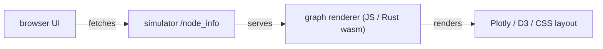

# visualization crate — architecture

Purpose: web-based visualization of simulation state (consumes `/node_info` from simulator).

Notes:
- The web UI normalizes node metadata (type, upstream/downstream) and draws a top-level graph.
- `visualization/src/` contains helpers to convert node state to a layout for the client.
